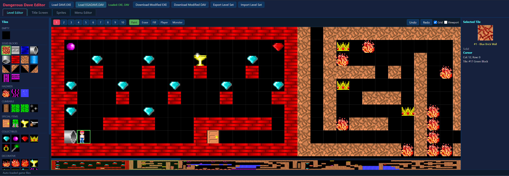

# Dangerous Dave Editor

A browser-based level, sprite, and graphics editor for the classic DOS game **Dangerous Dave** (John Romero, 1990). It works directly on the original game files — no extraction step, no external tools. Load `DAVE.EXE` and `EGADAVE.DAV`, edit everything visually, and download a modified, fully playable game.

Everything runs client-side in vanilla JavaScript (ES modules) — no build step, no dependencies, and your game files never leave the browser.



## Features

### Level Editor
- Visual editing of all 10 levels on the full 100×10 tile grid
- Paint, erase, and flood-fill tools with undo/redo (`Ctrl+Z` / `Ctrl+Y`)
- Tile palette grouped by behavior: solid blocks, hazards, climbable, collectibles, special items, decorative
- Minimap with draggable viewport, optional grid and in-game viewport (20×10) overlay
- Player start position editing (pixel-precise X/Y plus initial motion state)
- Monster placement with patrol path editing — including auto-generated default paths, and an EXE code patch that enables monsters on levels 1–2 (which the original engine doesn't support)

### Title Screen Editor
- Edit the 10×7 tile title screen layout
- Pixel-paint the flaming "Dangerous Dave" logo sprites, with EGA and VGA versions edited side-by-side and kept in sync

### Sprite Editor
- Pixel-level editing of Dave, monster, and projectile sprites
- Edits are applied to **both** the EGA data (`EGADAVE.DAV`) and the VGA data (inside the EXE), so the game looks right in every video mode
- EGA pre-shifted sprite copies (used for byte-aligned blitting) are regenerated automatically

### Menu Editor
- Edit in-game text strings (title, subtitle, menu text)
- Pixel-paint the EGA configuration screen icons (32×24, 4-plane)

### Import / Export
- Download the modified `DAVE.EXE` and `EGADAVE.DAV`, ready to run in DOSBox
- Export/import complete level sets as JSON to share or back up your work

## How it works

The editor understands the original binary formats end to end:

- **LZEXE decompression** — `DAVE.EXE` is packed with LZEXE (LZ91). The editor decompresses it in JavaScript on load and works on the decompressed image.
- **EGA graphics** — `EGADAVE.DAV` stores tiles as 4-plane EGA bitmaps behind an offset table; the editor decodes and re-encodes them losslessly.
- **VGA graphics** — VGA tiles inside the EXE use Keen 1–3 style RLE compression (8bpp). The editor decompresses, edits, recompresses, and writes them back surgically so the surrounding game code is untouched.
- **x86 code patches** — a few byte-exact patches are applied to the game code on save when needed:
  - Fixes the original VGA RLE decompressor bug (`MOV DI,0` → `AND DI,0Fh`) that corrupts graphics past offset 65280
  - Clamps the monster sprite-type computation so monsters work on levels 1–2
  - Optional warp zone and door-behavior patches
- **Header-size aware** — all EXE offsets are automatically adjusted to the actual MZ header size, so EXEs produced by different LZEXE unpackers still work.

## Getting started

You need your own copies of the original game files: `DAVE.EXE` and `EGADAVE.DAV`. **No game data is included in this repository.**

Because the editor uses ES modules, it must be served over HTTP (opening `index.html` from disk won't work). A tiny zero-dependency Node server is included:

```bash
node server.js
# open http://localhost:3000
```

Any static file server works just as well (`npx serve`, `python -m http.server`, etc.).

Then:

1. Click **Load DAVE.EXE** and pick your game EXE
2. Click **Load EGADAVE.DAV** and pick the EGA graphics file
3. Edit levels, sprites, title screen, and menus across the tabs
4. Click **Download Modified EXE** / **Download Modified DAV** and drop the files into your game folder

## Project structure

```
index.html               UI layout (tabs, toolbars, panels)
server.js                Minimal static file server for local use
css/style.css            All styling
js/
  main.js                App entry point, file loading, state wiring
  constants.js           Game constants, EXE data offsets, tile metadata
  lzexe.js               LZEXE (LZ91) decompressor/recompressor
  exe-parser.js          Level/player/monster data parser & writer
  tileset-parser.js      EGADAVE.DAV EGA tile decoder/encoder
  vga-parser.js          VGA RLE codec, surgical EXE writes, x86 patches
  level-editor.js        Canvas level editor (tools, undo, minimap)
  tile-palette.js        Tile selection sidebar
  player-editor.js       Player start position panel
  monster-editor.js      Monster placement & patrol paths
  title-screen-editor.js Title screen tile grid
  title-logo-editor.js   Logo sprite pixel editor (EGA+VGA)
  sprite-editor.js       Game sprite pixel editor (EGA+VGA)
  menu-editor.js         Menu text & EGA icon editor
  download.js            File download helpers
```

## Acknowledgments

- LZEXE decompression ported from [unpacklzexe](https://github.com/samrussell/unpacklzexe) by Sam Russell
- Format documentation from the community reverse-engineering efforts around Dangerous Dave and the Commander Keen RLE format

## Legal

This is a fan-made editing tool. It contains no copyrighted game assets or code from Dangerous Dave. You must own the original game to use it. Dangerous Dave is the work of John Romero.
